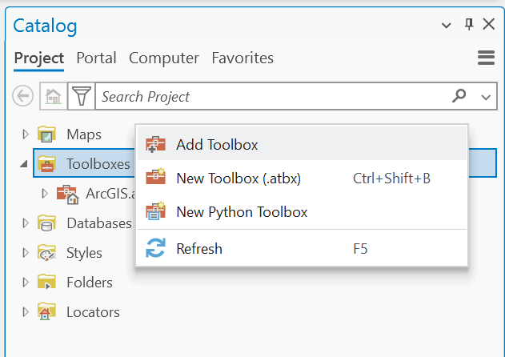
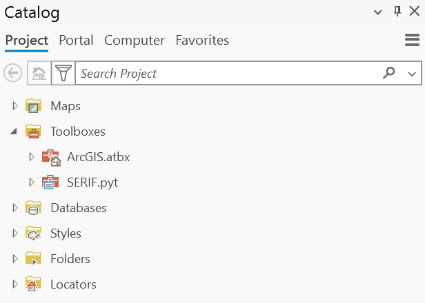
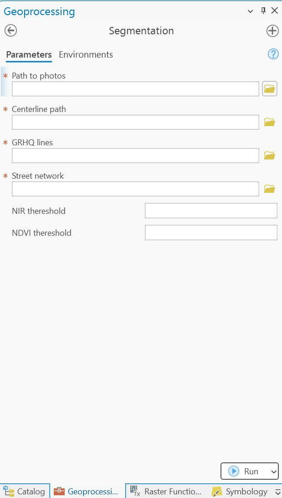

Usage of the SERIF toolbox
==========================

The only requirement to use the SERIF toolbox is to have an active license of ArcGIS pro.
In the repository, you will find a folder called ``SERIF_toolbox``, which contains all the tools
that will perform the automatic river segmentation.

To add the toolbox into your ArcGIS pro, you must go in the ArcGIS catalog and add it as
shown in the following image:

    

You will be prompt to a new window where you have to find the path in which you have downloaded
the ``SERIF`` repository and you need to select the file ``SERIF_toolbox/SERIF.pyt``.
Once you have succesfully added the toolbox, your catalog should look like this:

Once imported the ``SERIF`` toolbox, expand the small vignette and double click in the ``Segmentation`` tool.
You will be prompt to the next window:

.. role:: red

.. raw:: html

    

In this new window, the fields with the :red:`*` are mandatory. The correct way to fill up the fields is as follows:

#. *Path to photos:* Is the folder that contains the photos that are going to be processed.
#. *Centerline path:* Is the shape file that contains the drainage network for the study area
#. *GRHQ lines:* Is the Quebec Hydrographic Network Geobase (GRHQ). Can be found here: https://open.canada.ca/data/en/dataset/bfbdeb1d-8398-444b-ad78-ab81f9d14e60
#. *Street network:* Is the shapefile containing the street network.
#. *NIR and NDVI thresholds:* Are the thresholds for the segmentation process. They are optional values and if not filled, the tool will take 77 and 0.22 as default values respectively.