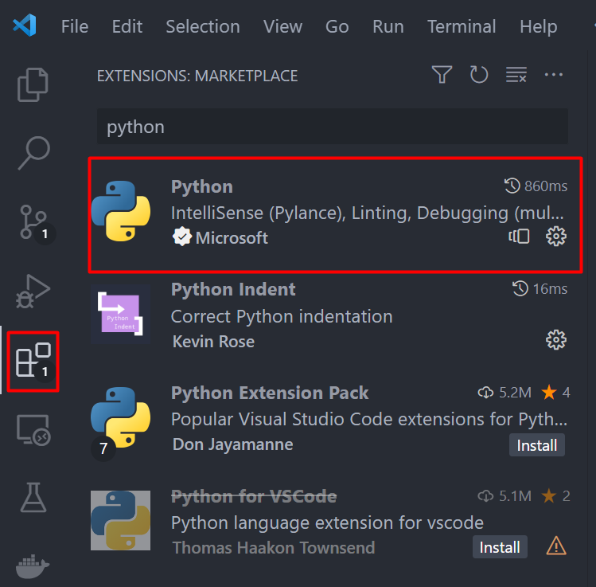
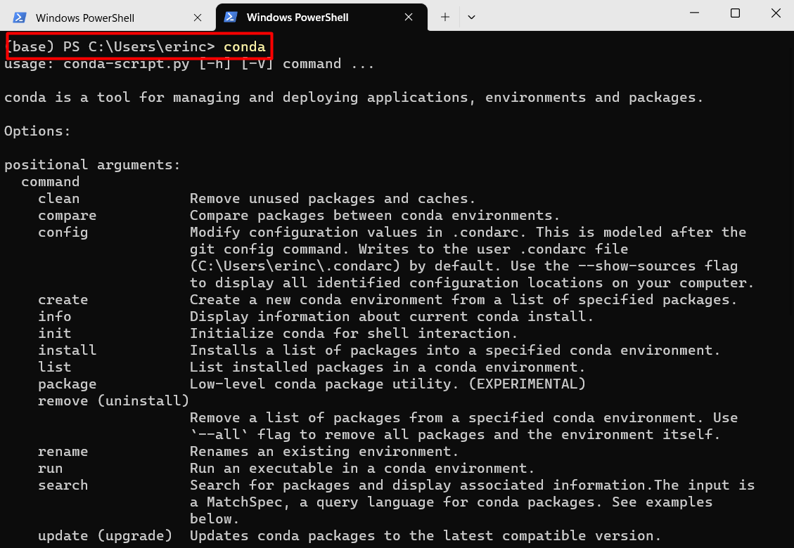

===================================
Configuring the running environment
===================================

In order to use the set of tools, it is necessary to setup your working environment.
Here, you will a step-by-step on how to configure it.

Installation of vscode
======================

Visual Studio Code is a free, open-source code editor that is available for Windows, Mac, and Linux.
It has a built-in terminal, debugger, and Git integration, making it a popular choice for user and developers.

Follow these steps to install Visual Studio Code:

#. Go to the Visual Studio Code `website <https://code.visualstudio.com/>`_.
#. Click the "Download for [your operating system]" button.
#. Run the downloaded installer and follow the prompts to complete the installation. Choose the default options unless you have a specific reason to change them.

Once the code editor is installed, we need to install the Python extensions, as shown in the next image:

With this extension installed, the code editor is ready to use.

Installation of Anaconda
========================

Anaconda is a popular data science platform with various tools and packages pre-installed.

To install Anaconda on Windows:

#. Download the Anaconda installer from the `official website <https://www.anaconda.com/products/individual>`_.
#. Run the downloaded installer and follow the prompts to complete the installation. Choose the default options unless you have a specific reason to change them.
#. Once the installation is complete, open the Anaconda Navigator from the Start menu to launch the Anaconda interface.

Setting up Anaconda Environment Variable in Windows
---------------------------------------------------

#. Open the Start menu and search for "Environment Variables" and click on "Edit the system environment variables".
#. In the "System Properties" window, click on the "Environment Variables" button.
#. Under "System Variables", scroll down and find "Path" and click "Edit".
#. Click "New" and add the path to the Anaconda executable, which is usually located at ``C:\Users\USERNAME\anaconda3``.
#. Click "OK" to close all the windows.

After setting up the Anaconda environment variable, you can use Anaconda commands in any command prompt or terminal window without
having to navigate to the Anaconda executable folder every time.

If you type ``conda`` in your command prompt you must see something like this

