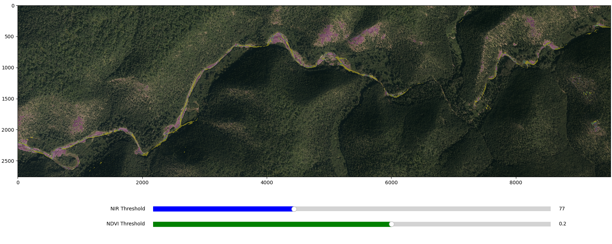

==========================================
Choosing the right NIR and NDVI thresholds
==========================================

The selection of the correct NIR and NDVI thresholds is a crucial step in the river segmentation process.
This process is curcial since it will improve the accuracy of the segmentation. Also, this threshold calibration
will reduce significantly the amount of manual corrections required after the segmentation is produced.

The ``SERIF toolbox`` provides the options of input individual thresholds for each image. These thresholds must stored
in the form of CSV files whitin the same folder as the image. The threshols definition and the further obtention of the
CSV files can be done usint the following script:

.. code-block:: python

    import os
    import sys
    import numpy as np
    import rasterio as rio
    sys.path.append(r"path/to/your/SERIF/toolbox")
    from src.visualisation import Visualisation

    # Initial thresholds to start the calibration
    NIR_THRESHOLD = 77
    NDVI_THRESHOLD = 0.2

    def list_tifs(path: str):
        files_list = []
        for file in os.listdir(path):
            if file.endswith(".tif"):
                files_list.append(file)
        return files_list

    def export_file(name: str, thereshold: tuple):
        # Extract file from tif image
        split_path = os.path.split(name)
        file_name = split_path[1].replace(".tif", ".csv")
        file_output_path = os.path.join(split_path[0], file_name)
        data = {
            "image_name": file_name.replace(".csv", ""),
            "ndvi": thereshold[0],
            "nir": thereshold[1]
        }
        # [file_name.replace(".csv",""),thereshold[0],thereshold[1]]
        # col_names = ["image_name","ndvi","nir"]
        df = pd.DataFrame(data=data, index=[0])
        df = df.set_index("image_name")
        # if not os.path.exists(file_output_path):
        df.to_csv(file_output_path, sep=",")

    def main():
        # Set the paths to the photos 
        photos_path = r"path/to/your/photos"
        center_line_path = r"path/to/your/centerline/shapefile.shp" #This shapefile must be in the same CRS as the photos
        files_list = list_tifs(photos_path)
        visualisation = Visualisation(center_line_path)
        for file in files_list:
            img_path = os.path.join(photos_path, file)
            with rio.open(img_path) as src:
                visualisation.dataset_rio = src
                extent_clip = visualisation.intersect_tif_and_shp()
                # Get bands
                red :np.ndarray = src.read(1)
                nir :np.ndarray = src.read(4)
                # Clip bands
                red = red[extent_clip.loc[0, "Index"]:extent_clip.loc[2, "Index"],
                        extent_clip.loc[1, "Index"]:extent_clip.loc[3, "Index"]]
                nir = nir[extent_clip.loc[0, "Index"]:extent_clip.loc[2, "Index"],
                        extent_clip.loc[1, "Index"]:extent_clip.loc[3, "Index"]]
                ndvi = (nir.astype(float)-red.astype(float)) / \
                    (nir.astype(float)+red.astype(float))
                ndvi[np.isnan(ndvi)] = np.nan
                rgb = visualisation.get_RGB(src, extent_clip)
                mask_nir = np.where(nir < NIR_THRESHOLD, 1, 0)
                mask_ndvi = np.where(ndvi < NDVI_THRESHOLD, 1, 0)
                # Refine NIR mask
                mask_nir = np.where((mask_ndvi == 1) &
                                    (mask_nir == 1), 1, 0)
                # Get total mask
                mask_ = mask_nir + mask_ndvi
                mask_ = mask_.astype(float)
                mask_[mask_ == 0] = np.nan
                ndvi_threshold, nir_threshold = visualisation.calibrate_threshold(rgb, mask_,
                                                                                ndvi, nir,
                                                                                NIR_THRESHOLD,
                                                                                NDVI_THRESHOLD)
                export_file(img_path, (ndvi_threshold, nir_threshold))

Once the script is run, you will see that a figure will pop in your screen like the following:

In this figure, the red line represents the NIR threshold and the blue line represents the NDVI threshold.
You can interactively move the sliders to find the best thresholds for the current photo. You can zoom in and out
to check in more detail a particular area of interest.

If youre are satisfied with the selected thresholds, you just need to close the figure and the CSV file with the selected thresholds
will be saved in the same folder as the image. The CSV strcuture should look like the following:

.. code-block:: bash

    image_name,ndvi,nir
    q16039_162_30cm_f05,0.2472023192585575,100

